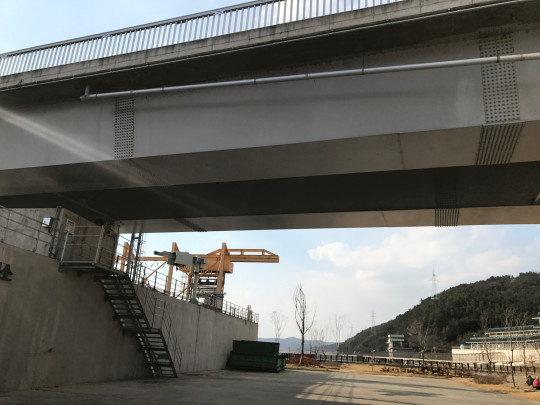
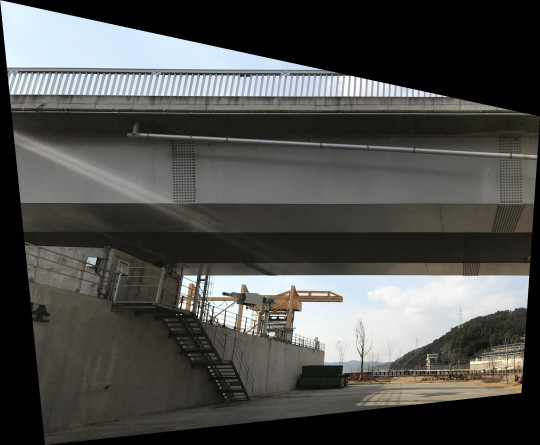

# Rectifying_Close-range_Images

## Input
* Input folder
  * Images to rectify
* in Code
  * 3-points on the target plane (**p{1}, p{2}, p{3}**)
  * Pixel size
  * Focal length
  * GSD(using **computeGSD** function)
***

## Output
* Rectified images
***
## Input & Output
Input | Output
--------- | ---------
 | 
***

## How to use
### Run ortho.m !!!(main code)

## Flow in this module
1. ortho.m
2. vertex_g.m
3. xy_g_min.m(executed in vertex_g.m)
4. computeGSD.m
5. dem_m.m
6. convert_dem.m
7. image_coordinate.m
8. pixel_color.m
